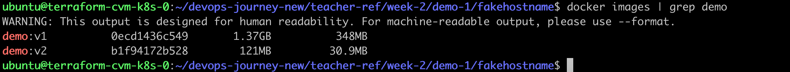
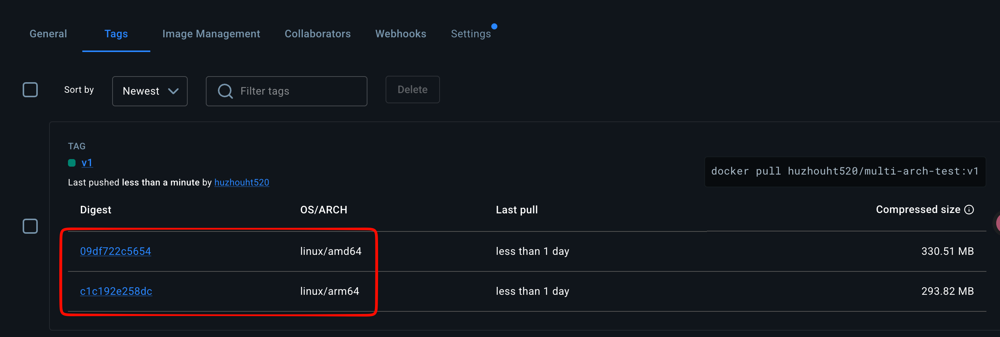
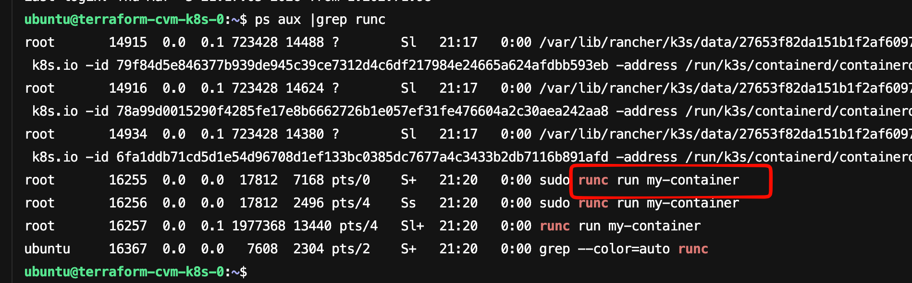

# Docker
## 原理
```
docker本质是宿主机上的一个进程；
只是这个进程通过Linux里的namespace和Cgroup、rootfs文件系统做了处理；
namespace把进程进行隔离，支持许多类型，如UTS、PID、NETWORK、USER等等，docker里的进程相当于认为自己是1号进程，尽管它可能在宿主机里是100号进程；
Cgroup对资源进行限制，防止把宿主机的资源占满；
rootfs隔离文件系统，容器内的进程只能看到rootfs里的文件，看不到宿主机的文件系统；

rootfs 通过联合挂载（Union Mount）实现常见的技术有：
以 OverlayFS 为例：
- 下层（lowerdir）：镜像层，只读
- 上层（upperdir）：容器层，可读写
- 合并视图（merged）：容器看到的统一文件系统

当容器修改文件时，采用 Copy-on-Write 机制：
- 读文件：直接读下层镜像
- 修改文件：复制到上层容器层再修改
- 删除文件：在上层标记为"whiteout"
```

## 实践
### 多阶段构建
主要是减小镜像的大小，一般在第一阶段编译生成想要的文件，然后把文件拷贝到第二阶段里；
因为第一阶段镜像有很多的编译工具等等，通过多阶段也能减少不安全的因素；
参考案例文件 my-practice/week-02/demo-1/fakehostname

```
# 构建两个镜像
docker build -f Dockerfile -t demo:v1 .
docker build -f Dockerfile2 -t demo:v2 .

# 查看镜像大小
docker images | grep demo
```
结果


### buildx进行多架构构建
1.先登录仓库，比如登陆到dockerhub，docker login
2.进入到Dockerfile目录构建，比如 my-practice/week-02/demo-1/fakehostname
  docker buildx build --platform linux/amd64,linux/arm64 -t huzhouht520/multi-arch-test:v1 --push
3.仓库上的生成结果


### runc启动容器测试
```
runc负责启动一个容器，属于底层的实现，docker、containerd、cri-o它们启动容器都是通过调用runc来实现，它们只是做上层的生命周期的管理；
```
1.先启动一个腾讯云主机，通过terraform
进入这个目录：teacher-ref/week-2
terraform init
terraform apply auto-approve
2.进入到cvm虚拟机的/tmp目录
cd /tmp
```
$ ls rootfs # 提前准备好的 busybox rootfs
$ runc spec # 生成一个 config.json 样例
$ cat config.json
$ sudo runc run my-container # 通过 runc 直接启动容器
$ ps aux
$ hostname
$ exit
```
