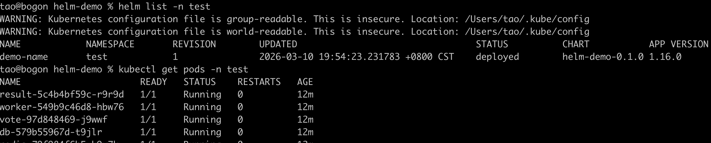

# helm
  命令分类快速参考：https://helm.sh/docs/intro/CheatSheet
## 从yaml文件到helm
### 快速实现
1.helm create helm-demo
2.删掉templates目录下yaml结尾的文件 
3.把可以执行成功的业务yaml文件copy到templates目录下
4.在helm-demo目录下执行测试
  helm install demo-name . --dry-run --namespace=test
5.执行安装
  helm install demo-name .  --namespace=test
6.查看结果

7.卸载
  helm uninstall demo-name  -n test